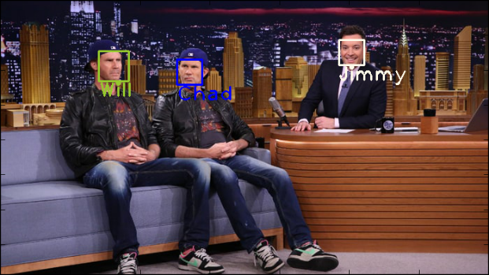
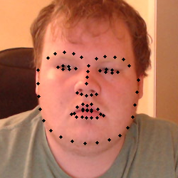

# Facial Recognition
##

Facial Recognition in live video streams. This requires opencv, dlib, and openface to run.

This is soon be used to automate player name entry in streams of super smash bros melee.

This works well enough classify several different people with few (20-25) training
examples. It can also classify people who look fairly similar like Will Ferrell 
and Chad Smith. 

## Extras

Included are options to use these facial recognition techniques to add features 
to images on the fly to a video stream. This is similar to the filters used by 
Snapchat. These are just for fun (and the amusement of my cousins) and are not as
polished as the filters used by Snapchat.

These extra features include:

 * Displaying the landmarks on faces 

 
 
 * Adding a mustache to the image  

 
 
 * Adding Vampire effects 

 
 
 * Adding Frankenstein features 
 
 

